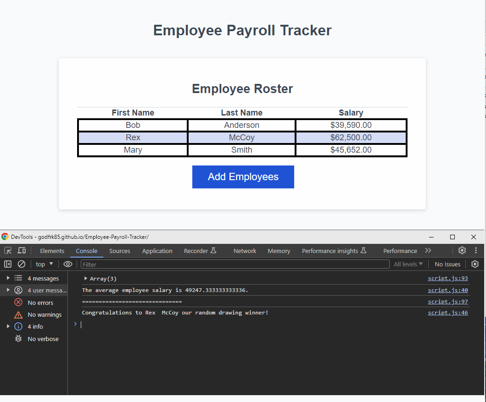

# Employee Payroll Tracker

## Description

This is an application that enables a payroll manager to view and manage employee payroll data. This app will run in the browser and will feature dynamically updated HTML and CSS powered by JavaScript code.

## User Story

AS A payroll manager
I WANT AN employee payroll tracker
SO THAT I can see my employees' payroll data and properly budget for the company

## Usage

You can use this website to log your payroll for your employees and see the average salary of your staff.

## Acknowledgment

Alexander Rodriguez help with debuging average salary.

Images

